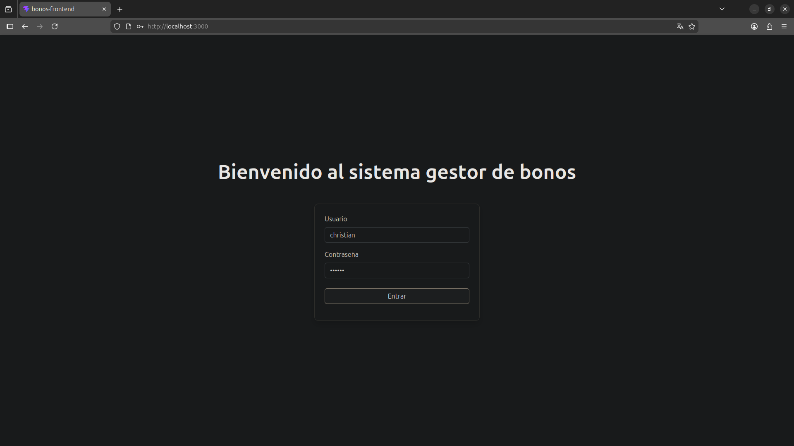
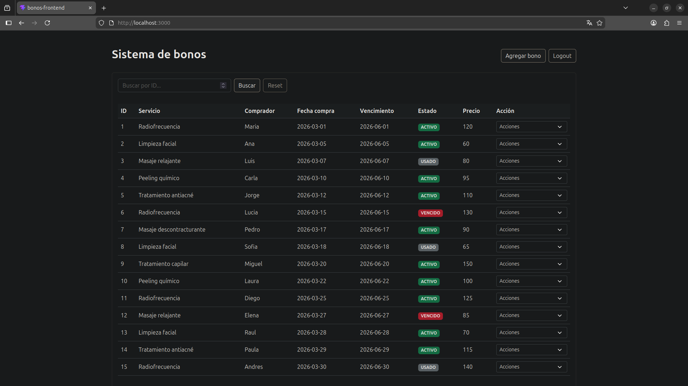
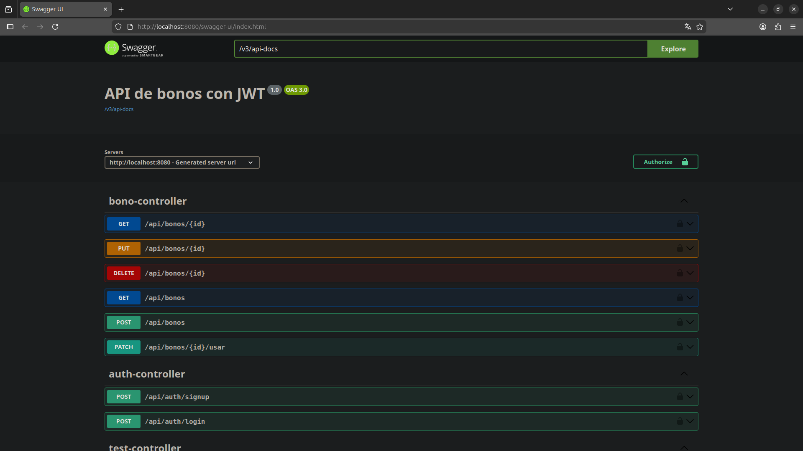

# 🎟️ Bonos App (Fullstack)

Aplicación fullstack para la gestión de bonos de servicios (ej. estética), compuesta por un backend en **Spring Boot** y un frontend en **JavaScript**, con autenticación JWT y arquitectura profesional.

> Proyecto desarrollado como parte de mi portfolio.

---

## 🚀 Demo

_(Próximamente / levantar con Docker)_

---


## 🧠 Características principales

- ✅ CRUD completo de bonos  
- 🔐 Autenticación y autorización con JWT  
- 📡 API REST estructurada  
- 🧾 Validación de datos (backend + frontend)  
- 🎨 Interfaz web funcional y responsive  
- ⚠️ Manejo de errores centralizado  
- 🧱 Arquitectura profesional en capas  

---

## 🏗️ Arquitectura

```text
Frontend (Vite + JS) → Backend (Spring Boot) → Base de datos (PostgreSQL)
```

## Organización Interna

    Backend: Controller → Service → Repository → DB

    Frontend: UI → Lógica (bonos.js) → API (fetch + JWT)

## 🖥️ Tecnologías 
### Backend

- Java 21 & Spring Boot
-   Spring Security (JWT)
-  Spring Data JPA (Hibernate)
-   PostgreSQL
-   Maven

### Frontend

- JavaScript (ES Modules)
-   Vite
-   Bootstrap 5
-  Fetch API

### DevOps

- Docker & Docker Compose

## 🔐 Seguridad

- Autenticación con usuario y contraseña.

- Generación de token JWT.

- Filtro de autenticación en cada request.
- Endpoints protegidos y persistencia del token en frontend.

## 📦 Estructura del proyecto

```
bonos-app/
├── backend/   # API REST (Spring Boot)
├── frontend/  # Aplicación web (Vite + JS)
└── docker-compose.yml
```

## ⚙️ Instalación y ejecución

### 🔥 Opción recomendada: Docker

```bash
git clone https://github.com/ChristianBihurriet/bonos-app.git
cd bonos-app
docker compose up --build
```  
#### Accesos

- Frontend → http://localhost:3000
- Backend → http://localhost:8080
- Swagger → http://localhost:8080/swagger-ui.html

---
### 🔐 Usuario de prueba
```
username: christian

password: 123456
```
---
### 📦 Datos iniciales

El proyecto incluye un `data.sql` que carga automáticamente:

- 👤 1 usuario
  - 🎟️ +15 bonos con distintos estados:
    - ACTIVO
    - USADO
    - VENCIDO
---


## 📡 Endpoints principales

### 🔑 Autenticación

| Método | Endpoint           | Descripción                         |
|--------|-------------------|-------------------------------------|
| POST   | /api/auth/signup  | Registro de usuario                 |
| POST   | /api/auth/login   | Inicio de sesión y obtención de JWT |

---

### 🎟️ Bonos

| Método | Endpoint       | Descripción                     |
|--------|---------------|---------------------------------|
| GET    | /bonos        | Listar todos los bonos          |
| GET    | /bonos/{id}   | Obtener detalle de un bono      |
| POST   | /bonos        | Crear un nuevo bono             |
| PUT    | /bonos/{id}   | Actualizar un bono              |
| DELETE | /bonos/{id}   | Eliminar un bono                |

## 🔄 Flujo de funcionamiento

```text
Login → JWT → Requests autenticados → Backend → DB → Respuesta → UI
```

## ⚠️ Notas técnicas

- Manejo de respuestas vacías (204 No Content)  
- Validación robusta en backend y frontend  
- Separación clara de responsabilidades  
- Uso de async/await para peticiones asíncronas  
- Configuración global de CORS  
## 📄 Documentación API

Si el backend está corriendo, puedes acceder a la interfaz de Swagger en:

👉 http://localhost:8080/swagger-ui.html

---
## 🧪 Testing

El proyecto incluye distintos niveles de testing:

- **Tests de integración**
  - Uso de MockMvc para probar endpoints reales
  - Seguridad JWT incluida
  - Base de datos H2 en memoria

- **Tests unitarios**
  - Lógica de negocio aislada (Service)
  - Uso de Mockito para simular repositorios

- **Configuración de entorno**
  - Perfil `test` con base de datos en memoria
  - Tests independientes de Docker/PostgreSQL

### ▶️ Para ejecutar los test:
```bash
cd backend
mvn test
```
---
## 📸 Screenshots

### 🔐 Login


### 🎟️ Bonos


### 📊 Swagger


## 📈 Mejoras futuras

- 🔍 Filtros avanzados por estado  
- 📊 Paginación de resultados  
- 📄 Exportación de bonos a PDF  
- 🔐 Implementación de roles y permisos detallados  
- 🧪 Testing unitario e integración (JUnit / Mockito)  
- ⏰ Tareas programadas (`@Scheduled`) para vencimientos  

## 👨‍💻 Autor

**Christian Bihurriet**  
Backend Developer (Java + Spring Boot)